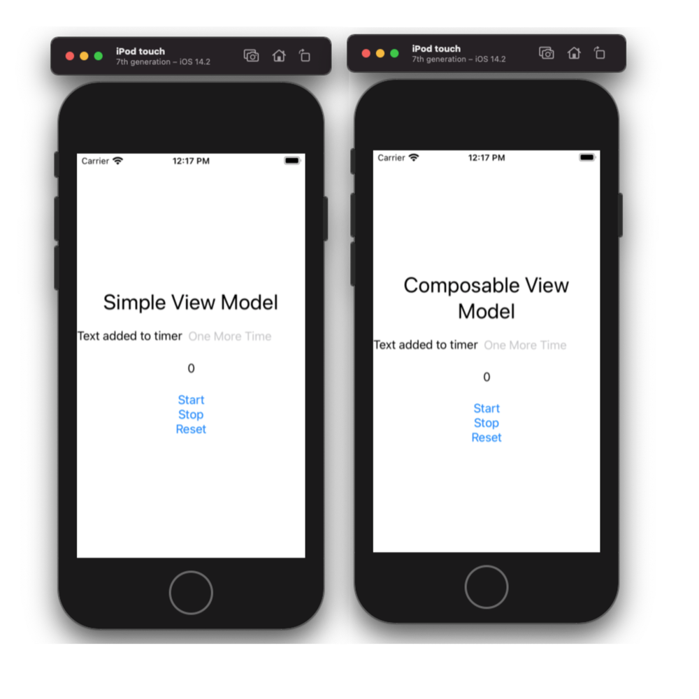

# Reactive-Combine-MVVM-Templates
This repository contains custom Xcode MVVM SwiftUI templates and code samples using them. See below for a full description and installation details.

## Installation

1. If it does not yet exist create the `Templates` folders under your home directory:

        $ mkdir -p ~/Library/Developer/Xcode/Templates

2. Copy the contents of the `MVVM Templates` folder in this repository into the above folder.

        $ cp -r "MVVM Templates" ~/Library/Developer/Xcode/Templates/

3. The templates appear in the Xcode "File/New/File" template browser under a `MVVM Templates` group.


You can change the name of this group by renaming the installation folder  `MVVM Templates` to what you want.

## Examples 


Examples of both SwiftUI MVVM templates. Both are in this repo and working under simulator.
Both ViiewModels use Combine for bindings.

### Task 

Create SwiftUI timer app containing 3 buttons(start, stop, reset timer) one text input. App should display timer(seconds) after text entered in text input fileld. Output should be like this: "Entered text:10" in separate text field. See screenshots below examples header. 
App should use reactive MVVM.

### Simple MVVM example 
Check [this](./SwiftUITestProj/SimpleTimerExample) folder for details.

To use same template for all ViewModels we need to inherit all ViewModels from some abstract protocol. [Check](./SwiftUITestProj/AbstractViewModel.swift)

```swift
protocol AbstractViewModel {
    associatedtype Input
    associatedtype Output
    
    func bind(_ input: Input) -> Output
}
```
Timer app we want to implement will have next ViewModel
[Check](./SwiftUITestProj/SimpleTimerExample/TimerViewModel.swift)

```swift
final class TimerViewModel: AbstractViewModel {
    
    let startTime: Int = 0
    
    struct Input {
        var startTap: AnyPublisher<Void, Never>
        var stopTap: AnyPublisher<Void, Never>
        var resetTap: AnyPublisher<Void, Never>
        var textChanged: AnyPublisher<String, Never>
    }
    
    struct Output {
        var timerWithText: AnyPublisher<String, Never>
    }
    
    struct AppEnvironment {
        var timer: TimerProtocol.Type
    }
    
    var environment: AppEnvironment!
    
    func bind(_ input: Input) -> Output {
        enum TimerState {
            case running
            case stopped
            case reset
        }
        
        let savedTime = CurrentValueSubject<Int, Never>(startTime)
        
        let timer = Publishers.Merge3(input.startTap.map{ TimerState.running } , input.stopTap.map{ TimerState.stopped }, input.resetTap.map{ TimerState.reset } )
            .map { state -> AnyPublisher<Int, Never> in
                switch state {
                case .running:
                    return self.environment.timer.timerPublisher(1.0)
                        .withLatestFrom(savedTime)
                        .map { $0 + 1 }
                        .eraseToAnyPublisher()
                case .stopped:
                    return Empty(outputType: Int.self, failureType: Never.self).eraseToAnyPublisher()
                case .reset:
                    return self.environment.timer.timerPublisher(1.0)
                        .scan(self.startTime, { (currentTime, timer) -> Int in
                            currentTime + 1
                        })
                        .prepend(self.startTime)
                        .eraseToAnyPublisher()
                }
            }
            .switchToLatest()
            .handleEvents(receiveOutput: { currentTime in
                savedTime.send(currentTime)
            })
            .prepend(startTime)
        
        let timerAndText = Publishers.CombineLatest(input.textChanged, timer)
            .map { text, time in
                text.isEmpty ? "\(time)" : "\(text):\(time)"
            }
            .eraseToAnyPublisher()
        
        let output = Output(timerWithText: timerAndText)
        return output
    }
}
```

TimerProtocol is like this:

```swift
protocol TimerProtocol {
    static var timerPublisher: (TimeInterval) -> AnyPublisher<Date, Never> { get }
}

extension Timer: TimerProtocol {
    static var timerPublisher: (TimeInterval) -> AnyPublisher<Date, Never> {
        return { interval in
            Self.TimerPublisher(interval: interval, runLoop: .main, mode: .default).autoconnect().eraseToAnyPublisher()
        }
    }
}
```
It should allow easy unit test dependency injection replacement.
[Check](./SwiftUITestProj/DependencyInjectionManager.swift)


And finally SwiftUI view is next:
[Check](./SwiftUITestProj/SimpleTimerExample/TimerView.swift)

```swift
struct TimerView: View {
    @State var time: String = ""
    
    var viewModel: TimerViewModel
    var output: TimerViewModel.Output
    
    
    let start = PassthroughSubject<Void, Never>()
    let stop = PassthroughSubject<Void, Never>()
    let reset = PassthroughSubject<Void, Never>()
    
    @SubjectBinding var text: String = ""
    
    init(viewModel: TimerViewModel) {
        self.viewModel = viewModel
        
        let input = TimerViewModel.Input(startTap: start.eraseToAnyPublisher(),
                                         stopTap: stop.eraseToAnyPublisher(),
                                         resetTap: reset.eraseToAnyPublisher(),
                                         textChanged: _text.anyPublisher())
        
        output = viewModel.bind(input)
    }
    
    var body: some View {
        VStack {
            Text("Simple View Model")
                .font(.largeTitle)
                .multilineTextAlignment(.center)
            
            HStack {
                Text("Text added to timer")
                TextField("One More Time", text: $text)
            }
            
            Text(time)
                .padding()
            
            Button("Start") {
                start.send()
            }
            
            Button("Stop") {
                stop.send()
            }
            
            Button("Reset") {
                reset.send()
            }
        }
        .onReceive(output.timerWithText, perform: { time in
            self.time = time
        })
    }
}
```
This view is using @SubjectBinding property wrapper for quick reactive binding creation
[Check](./SwiftUITestProj/PropertyWrappers/SubjectBinding.swift)

### Composable MVVM example 
Check [this](./SwiftUITestProj/ComposedTimerExample) folder for details.

Composable MVVM is [Redux](https://redux.js.org/) like or [The Composable Architecture](https://github.com/pointfreeco/swift-composable-architecture/blob/main/README.md) like MVVM.

Main idea is having AppState structure(UI representetion for ViewModel) and AppAction enum(actions that modifies AppState).

To use same template for all Composable ViewModels we need to inherit all Composable ViewModels from some abstract protocol.
[Check](./SwiftUITestProj/ComposableViewModel.swift)

```swift
protocol ComposableViewModel: AbstractViewModel where Output == AnyPublisher<AppState, Never> {
    associatedtype AppState
    associatedtype AppAction
    
    var initialState: AppState { get }
    
    func reduce(_ state: inout AppState, action: AppAction)
    func convert(_ input: Input, stateSubject: CurrentValueSubject<AppState, Never>) -> AnyPublisher<AppAction, Never>
}

extension ComposableViewModel {
    private func prepareReduce(_ state: AppState, action: AppAction) -> AppState {
        var modifiedState = state
        
        reduce(&modifiedState, action: action)
        
        return modifiedState
    }
    
    func bind(_ input: Input) -> AnyPublisher<AppState, Never> {
        let stateSubject = CurrentValueSubject<AppState, Never>(initialState)
        
        return convert(input)
            .withLatestFrom(stateSubject) { prepareReduce($1, action: $0) }
            .handleEvents(receiveOutput: stateSubject.send)
            .prepend(initialState)
            .share(replay: 1)
            .eraseToAnyPublisher()
    }
}
```
Timer app we want to implement will have next Composable ViewModel
[Check](./SwiftUITestProj/ComposedTimerExample/ComposedTimerViewModel.swift)

```swift
final class ComposedTimerViewModel: ComposableViewModel {
    struct Input {
        var startTimer: AnyPublisher<Void, Never>
        var stopTimer: AnyPublisher<Void, Never>
        var resetTimer: AnyPublisher<Void, Never>
        var textChanged: AnyPublisher<String, Never>
    }
    
    struct AppState {
        var time: Int = 0
        var text: String = ""
    }
    
    enum AppAction {
        case resetTime
        case incrementTime
        case modifyText(String)
    }
    
    struct AppEnvironment {
        var timer: TimerProtocol.Type
    }
    
    var environment: AppEnvironment!
    
    let initialState: AppState
    
    init(initialState: AppState) {
        self.initialState = initialState
    }
    
    func reduce(_ state: inout AppState, action: AppAction) {
        switch action {
        case .incrementTime:
            state.time += 1
        case .resetTime:
            state.time = 0
        case .modifyText(let text):
            state.text = text
        }
    }
    
    func convert(_ input: Input, stateSubject: CurrentValueSubject<AppState, Never>) -> AnyPublisher<AppAction, Never> {
        enum TimerActions {
            case start
            case stop
            case reset
        }
        
        let timer = Publishers.Merge3(input.startTimer.map { TimerActions.start }, input.stopTimer.map { TimerActions.stop }, input.resetTimer.map { TimerActions.reset })
            .flatMapLatest { action -> AnyPublisher<Void, Never> in
                switch action {
                case .start, .reset:
                    return self.environment.timer.timerPublisher(1.0).map { _ in () }.eraseToAnyPublisher()
                case .stop:
                    return Empty(outputType: Void.self, failureType: Never.self).eraseToAnyPublisher()
                }
            }
        
        let actions = Publishers.Merge3(timer.map { AppAction.incrementTime }, input.resetTimer.map { AppAction.resetTime }, input.textChanged.map { AppAction.modifyText($0) })
            .eraseToAnyPublisher()
        return actions
    }
}
```

And finally Composable SwiftUI view is next:
[Check](./SwiftUITestProj/ComposedTimerExample/ComposedTimerView.swift)

```swift
struct ComposedTimerView: View {
    @State var state: ComposedTimerViewModel.AppState
    
    let viewModel: ComposedTimerViewModel
    let output: ComposedTimerViewModel.Output
    
    let start = PassthroughSubject<Void, Never>()
    let stop = PassthroughSubject<Void, Never>()
    let reset = PassthroughSubject<Void, Never>()
    
    @SubjectBinding var text: String = ""
    
    init (viewModel: ComposedTimerViewModel) {
        _state = State(wrappedValue: viewModel.initialState)
        
        self.viewModel = viewModel
        
        let input = ComposedTimerViewModel.Input(startTimer: start.eraseToAnyPublisher(),
                                                 stopTimer: stop.eraseToAnyPublisher(),
                                                 resetTimer: reset.eraseToAnyPublisher(),
                                                 textChanged: _text.anyPublisher())
        output = viewModel.bind(input)
    }
    
    var body: some View {
        VStack {
            Text("Composable View Model")
                .font(.largeTitle)
                .multilineTextAlignment(.center)
            
            HStack {
                Text("Text added to timer")
                TextField("One More Time", text: $text)
            }
            
            Text(state.text.isEmpty ? "\(state.time)" : "\(state.text):\(state.time)")
                .padding()
            
            Button("Start") {
                start.send()
            }
            
            Button("Stop") {
                stop.send()
            }
            
            Button("Reset") {
                reset.send()
            }
        }
        .onReceive(output, perform: { state in
            self.state = state
        })
    }
}

struct ComposedTimerPreviews: PreviewProvider {
    static var diManager: DependencyInjectionProtocol {
        return DependencyInjectionManager()
    }
    
    static var previews: some View {
        diManager.composableTimerView()
    }
}
```

What is TimerProtocol and SubjectBinding see in simple MVVM example

## Conclusion 

Want to use cool MVVM templates in your XCode? Just install them and use in your app.
You can simply switch them to RxSwift or other reactive library you want instead of Combine.

# Credits

Reactive-Combine-MVVM-Templates is owned and maintained by [email](mailto:serbats@ukr.net).

# License

SwiftUISkeleton is released under the MIT license. See [LICENSE](https://github.com/serbats/Reactive-Combine-MVVM-Templates/blob/main/LICENSE) for details.
